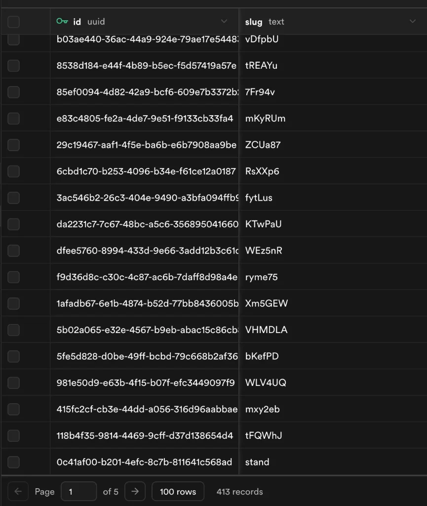

<div align="center">
  

  <h1>ul0 — Branded Custom Domain Link Shortener</h1>

  <p>A free URL shortener, branded link management platform, and multi-tool utility suite built for startups, creators, and digital marketers.</p>

  <p>
    <a href="https://www.nxgntools.com/tools/ul0?utm_source=ul0" target="_blank">
      
    </a>
    &nbsp;
    <a href="https://www.producthunt.com/products/ul0?embed=true&utm_source=badge-featured" target="_blank">
      
    </a>
    &nbsp;
    <a href="https://dashboard.simpleanalytics.com/ul0.site" target="_blank">
      
    </a>
  </p>

  <p>
    <a href="https://frogdr.com/ul0.site" target="_blank">
      
    </a>
    &nbsp;
    <a href="https://www.seobility.net/en/seocheck/check?url=https%3A%2F%2Ful0.site%2F">
      
    </a>
  </p>

  <p>
    <a href="https://ul0.site"><strong>Live Website</strong></a>
    &nbsp;&middot;&nbsp;
    <a href="https://ul0.site/pricing"><strong>Pricing</strong></a>
    &nbsp;&middot;&nbsp;
    <a href="https://ul0.site/docs"><strong>API Docs</strong></a>
    &nbsp;&middot;&nbsp;
    <a href="./SECURITY.md"><strong>Security Policy</strong></a>
  </p>

  ---
</div>

## Platform Overview

ul0 is a multi-tenant SaaS platform that lets businesses create short links served from their own domain. It is built on Next.js 16 App Router with Appwrite as the data layer, deployed on Vercel with edge-grade performance.

The platform ships in two tiers: a **free public tool** (no signup, anonymous link creation, full utility suite) and an **authenticated SaaS layer** (custom domains, click analytics, subscription billing, and developer API access).

---

## Core SaaS Features

### Branded Custom Domains

Connect your own domain (e.g. `link.yourbrand.com`) to serve fully white-labelled short links.

- Point a CNAME record to `cname.vercel-dns.com` or the project-specific Vercel endpoint
- DNS verification and SSL certificates are provisioned automatically through the Vercel Domains API
- Every domain is isolated per-tenant — one account's links can never be resolved by another's domain

### Link Analytics

Real-time click tracking accessible from the dashboard for each shortened link:

- Click count, device type (mobile / desktop)
- Referrer source and geographic country
- Per-link QR code customization with logo upload, custom colors, and footer branding

### UTM Campaign Builder

Build and save structured campaign URLs with Source, Medium, Campaign, Term, and Content parameters directly from the dashboard.

### Developer API

Generate and revoke API keys from the dashboard. Use the keys to shorten links programmatically:

```bash
curl -X POST https://ul0.site/api/shorten \
  -H "x-api-key: YOUR_KEY" \
  -H "Content-Type: application/json" \
  -d '{"url": "https://example.com/your-long-link"}'
```

Code templates for JavaScript, Python, and Go are available on the [API docs page](https://ul0.site/docs).

### Subscription Plans

| Plan | Price | Custom Domain Links | Analytics |
|:---|:---|:---|:---|
| Free | $0 / mo | 1 link | Basic |
| Pro | ~$2 / mo (annual) | Unlimited | Full |
| Business | ~$6 / mo (annual) | Unlimited + Priority | Full |

Billing is handled by Stripe. Plan limits are enforced server-side by `clerkUserId` scope on every write operation.

---

## Utility Tools

All tools are client-side, privacy-first, and require no account:

| Tool | Description |
|:---|:---|
| URL Shortener | Anonymous link creation with safe-destination scanning |
| Expense Splitter | Optimised group bill splits with UPI Scan-and-Pay QR codes |
| PDF Scanner | Camera capture, auto-crop, page sorting, and multi-page PDF export |
| WiFi QR Generator | Shareable scan-to-connect cards without exposing passwords |
| World Clock | Live time display across multiple time zones |
| Pomodoro / Countdown | Focus timers for productivity sessions |
| Ambient Sounds | Background soundscapes for focus |
| JSON Formatter | Pretty-print and validate JSON in the browser |
| Daily Quotes | Curated motivational content |

---

## Architecture

```
Browser → Vercel Edge (Next.js 16 App Router)
              ↓
         Upstash Redis  ←  slug cache + rate limits
              ↓ (cache miss)
         Appwrite Cloud ←  links, accounts, domains, subscriptions
              ↓
         Clerk Auth     ←  session verification per request
              ↓
         Vercel Domains ←  custom domain attach / SSL
```

| Layer | Technology |
|:---|:---|
| Framework | Next.js 16 (Turbopack, App Router) |
| Database | Appwrite Cloud |
| Cache / Rate Limiting | Upstash Redis |
| Authentication | Clerk (Google OAuth) |
| Billing | Stripe (Monthly + Annual) |
| Hosting | Vercel |

---

## Local Development

**Prerequisites**: Node.js 20+ or Bun

```bash
# 1. Clone
git clone https://github.com/Saketkesar/ul0.git
cd ul0

# 2. Install
npm install

# 3. Configure environment
cp .env.example .env   # fill in the variables below
```

Required environment variables:

```env
# Appwrite
APPWRITE_ENDPOINT=https://fra.cloud.appwrite.io/v1
APPWRITE_PROJECT_ID=
APPWRITE_API_KEY=
APPWRITE_DATABASE_ID=ul0

# Upstash Redis
UPSTASH_REDIS_REST_URL=
UPSTASH_REDIS_REST_TOKEN=

# Clerk
NEXT_PUBLIC_CLERK_PUBLISHABLE_KEY=pk_...
CLERK_SECRET_KEY=sk_...

# Vercel Domains Integration
VERCEL_AUTH_TOKEN=
VERCEL_PROJECT_ID=
```

```bash
# 4. Start dev server
npm run dev
```

Open [http://localhost:3000](http://localhost:3000).

---

## Organic Growth

Built entirely for organic search. Over 400+ user-generated short link records in production, growing without paid acquisition.

<div align="center">
  
</div>

---

## License & Security

This project is licensed under the **GNU Affero General Public License v3.0 (AGPL-3.0)**.

[](https://www.gnu.org/licenses/agpl-3.0)

This means:
- You can freely use, study, and modify the code.
- If you deploy a modified version as a network service, you **must** release your changes under the same license.
- Commercial use is permitted, but proprietary forks that are served to users are not.

Copyright &copy; 2025–2026 Saket Kesar — [ul0.site](https://ul0.site)

For vulnerability disclosures, see [SECURITY.md](./SECURITY.md).
